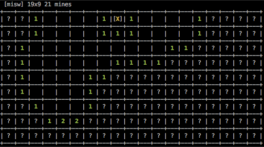

# MIneSWeeper

A quick-n-dirty game of minesweeper for the terminal.

## Usage

Compile & run the `misw` binary. The keyboard keys are mapped as the following...

 - <kbd>N</kbd> Start a new game.
 - <kbd>Q</kbd> Quite application.
 - <kbd>F</kbd> Flag current cell.
 - <kbd>SPACE</kbd> Select current cell.
 - <kbd>&#8593;</kbd> <kbd>&#8595;</kbd> <kbd>&#8592;</kbd> <kbd>&#8594;</kbd> Navigate board.

## Installation from distributed source

Nothing special about this. Standard configure, make, & install.

    tar zxvf misw-1.0.tar.gz
    cd misw-1.0
    ./configure
    make
    sudo make install

## Installation from Git source

Checking out code from git will require an additional autotool step.

    autoreconf -i -f
    ./configure
    make
    sudo make install

## Feedback

This project was a quick weekend exercise. Any [issues & feedback](https://github.com/emcconville/misw/issues) are welcomed.

